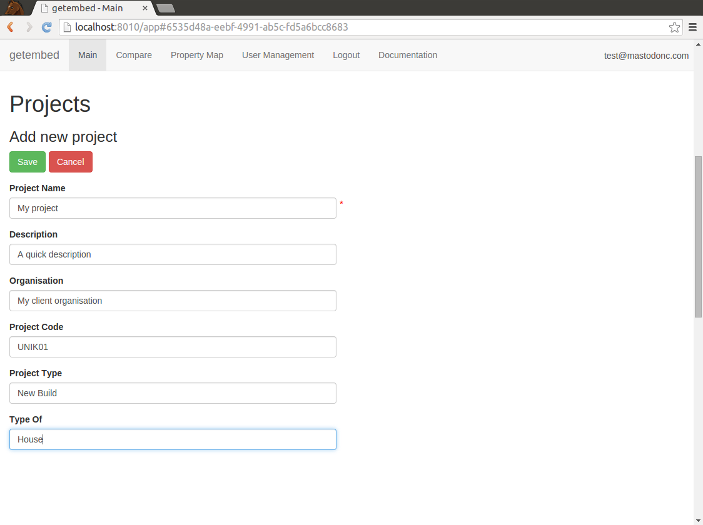

# Introduction

# Login

# User Management

Click on the User Management Tab to see the User Management
screen. This allows you to search for any user in the system by their
registered email address and add them to any programmes or projects
that you are a Programme Manager or Project Manager for.

## Editing Users

If you are an administrator you can set the overall role for a user as
User, Admin or Super Admin. If you are not an administrator but are a
Programme or Project Manager, then you can make a user into a
Programme Manager, Project Manager or user on any Programme or Project
you manage.

All managers and administrators have rights to edit data in programmes
or projects they have been added to. These rights cascade down into
the projects, properties, devices etc contained in the Programme or
Project they are a manager for.

All users have the right to view private data in the programmes or
projects they have been added to.

Here is an example of making a user a Programme Manager.

This is what it looks like when you have successfully edited a user.

# Programmes

Programmes allow you to have multiple projects in with one overview
and leadership team. Project Managers and users on projects can only
see data in their projects allowing for privacy between project teams,
but an overview for the programme team.

## Before Adding

## Adding

## After Adding

## Viewing

# Projects

Projects are a way of getting people together to work on a group of
properties. All data in a project are editable by a Programme or
Project Manager. Users in a project can view all private data in that
project.

## Adding a Project

Projects must have a project name.

## Listing Projects

## Viewing project details

# Uploading Property Details

[This Excel spreadsheet](example-property.xlsx) has been designed to
comprehensively capture the diverse range of building characteristics
(house type, construction, technologies installed); plus very
top-level info on the initial design intention and final output. The
information in this form will be fed directly into the Embed database
associated with each dwelling with the intention of giving external
parties a clear view on the home, technologies installed and the
intended/achieved performance.

Information is required from the dwelling as designed, and from the
dwelling as built, as these specifications may be different. There are
also opportunities to add interventions that identify times when the
performance of the dwelling may change. This could be an intervention
in the fabric, service or a change in occupation.

There are many data fields for completion, but not all will be
relevant to your study building(s). Please attempt to complete all
relevant fields to the best of your ability.

As far as is possible fields have been pre-populated with information
for you to select, however we fully expect there to be omissions and
encourage the giving of additional info in boxes that request either
'specify or give further information' boxes. These fields should only
be used for giving clarifications - any narrative in relation to
changes in specifications and the reasons for change, or unexpected
challenges arising from the project must be captured in detail on the
final reporting template document that accompanies this workbook.

Some cells have comments boxes that contain further information and
guidance. These are identified by a small red tag in the top right
corner of the cell.

## Important information:

This workbook collects information from a single property in your
study. A different datasheet must be completed for each property being
physically monitored. If dwellings are similar then the workbook can
be duplicated with relevant amends made to the information
contained. Sheets do not need to be competed for those dwellings that
are having qualitative assessments only.

Most parts of the workbook should be self-explanatory. Every data
entry cell will prompt for the information required though a pop-up
box, which will appear when the cell is active. If there is any
uncertainty when attempting to answer questions, or what units /
metrics to are required when completing values, please follow SAP
conventions and clarify using the 'specify or give further
information' boxes.

There are 5 types of data entry cell:

* Free numeric field = please put in a number. There is no need to put
  the metric for that number (e.g. %, m, kWh).
* Date = please input the date required in the format dd/mm/yyyy
  unless otherwise stated (all date cells should be preformatted to
  dd/mm/yyyy)
* Please select = these are dropdown lists that have been
  pre-populated. Some dropdown lists have the opportunity to select
  "Other (please specify)". For reasons of accurate categorisation
  please only use "other" as a last resort if the supplied definitions
  are totally inappropriate. When choosing "Other (please specify)"
  please always categorise the other solution utilised in the space
  provided.
* Free text field = please type your answer; there should not be a
  limit to the amount of text you can enter. In free text boxes please
  press Alt+Return for a new line.
* Specify or give further information = If you have chosen "other" as
  an option please specify here, or give further information. Please
  keep comments brief and relevant to the row question.

There are some cells that require more specific information and
guidance is given below

### Property code (row 3)

Please use a name / code to identify this property. This should be the
same name / code that you have been using to describe this property
throughout the reporting process and my be in the form of "plot x" or
"dwelling y". You should avoid using real property names / numbers.

Use the same property code for create, as designed, as built and any
interventions to identify which property the data relates to.

For circumstances where you have more than one property you can use
multiple workbooks. But remember to use a different property code,
consistent with your reporting, to identify it as a different
property.

### Event (row 4)

We are collecting information on different stages of the build and
Embed has four "event types" to achieve this:

* Create: takes static information about the property that does not
  change (e.g. address, dwelling type, location, project and
  property). From the dropdown select create and enter information
  from the area highlighted in blue only.
* As designed: takes information from the design stage of the
  development. Please complete the boxes in white as completely as
  possible.
* As built: represents the final dwelling characteristics. Information
  can be copied from the "as designed" column but care must be taken
  to ensure that all the fields are revised to reflect the building
  that was actually completed.
* Intervention: if any changes to have been made to the dwelling
  (e.g. remedial works to the fabric, re-commissioning of services or
  a change in occupation) this should be specified in a new column
  classified as an intervention. The intervention must be dated as
  accurately as possible.

### Timestamp (row 5)

This is needed primarily for tracking intervention dates, but the
system requires a date for create, as designed and as built. For ease
use the BPE contract end date for the "create" value, use the
approximate date for when the original designs were drawn-up for the
"as designed" value, and the approximate date for when the development
started for the "as built" value.

### Project details section (rows 27 to 32)

The responses to these questions should be reasonably brief but
informative and have a proper sentence structure to give context to
the project.

### Approach / lessons learnt (rows 35 to 40):

There are two responses required for these items. For the "as
designed" information please outline the intentions and approach. For
the "as built" information please respond from the position of lessons
learnt. As above the responses to these questions should be reasonably
brief but informative and have a proper sentence structure.

### Airtightness (row 89):

Add the target airtightness at design stage in the "as designed" value
column.  For the BPE mandatory airtightness test (Phase 1 and 2
studies) add this to the "as built" column.  For the 2nd airtightness
test (carried out at the end of Phase 2 studies only) create a new
intervention and add the airtightness test result in the intervention
column

### BUS survey (rows 92 to 103):

Please give the BUS result between 1 and 7. This is taken from the BUS
Summary (overall variables table) which was supplied by Arup. Please
complete this for "as built" only.  If a second BUS has been
undertaken please add this as an intervention

### Row 105 onwards (fabric, systems and technologies):

Generally we are expecting a response for each technology present and
the predominant performance values for fabric elements. However there
may be some circumstances where there are multiple elements / systems
/ technologies present (e.g. heating and hot water systems). If this
is the case then the relevant rows can be duplicated, ensuring that
the primary system comes first.
